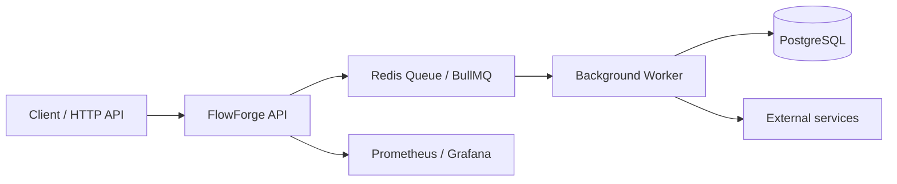

# FlowForge

FlowForge is a distributed job processing platform built with NestJS, PostgreSQL, Redis, and BullMQ. The project is designed to process asynchronous workloads such as email delivery, report generation, image processing, notifications, imports, and data jobs without blocking the HTTP request lifecycle.

## Why this project exists

FlowForge is a production-oriented distributed job processing platform designed around asynchronous execution, reliability, observability, and operational recovery. It focuses on the real concerns of a production-oriented async backend: queueing, workers, retries, persistence, observability, and scalability.

## Architecture decisions

### 1. NestJS as the application shell

NestJS was chosen because it offers clear modular boundaries, dependency injection, validation, and a structure that scales with complexity. In a distributed job platform, that matters because orchestration logic, queue handling, job states, and API contracts grow quickly.

### 2. Prisma as the source of truth for job state

PostgreSQL is the persistence layer, and Prisma is the data access layer. This gives the project a strongly typed model, migration support, and a cleaner representation of the domain. The job lifecycle is modeled explicitly with states such as WAITING, PROCESSING, COMPLETED, FAILED, and RETRYING.

### 3. Redis + BullMQ for async execution

Redis provides the broker layer, and BullMQ handles queueing and worker execution. This separation is a classic pattern for background processing because it decouples API response time from long-running work and enables retry, concurrency, and priority handling.

### 4. Modular domain decomposition

The codebase is organized by feature and infrastructure boundaries rather than a flat controller/service layout. This keeps the application easier to evolve when more job types, integrations, and worker strategies are added.

### 5. Idempotency and retry safety

A distributed platform must protect itself from duplicate execution. The API checks an idempotency key before enqueuing a new job, and the job model tracks retry counts and backoff timing. That prevents the same work from being processed multiple times accidentally.

### 6. Dead-letter queue and operational resilience

When a job exhausts its retry budget, it is moved to a dedicated Dead Letter Queue. This allows the system to preserve the failure context without losing the ability to diagnose or replay the failed workload.

### 7. Observability and production readiness

This project exposes Prometheus metrics and is designed to integrate cleanly with Grafana. OpenTelemetry distributed tracing is planned and documented in the roadmap once core logic and observability are stable. That matters because production backend systems are judged not only by code quality, but by how observable they are during incidents and scale events.

## Project structure

```text
src/
  app.controller.ts
  app.module.ts
  app.service.ts
  main.ts
  main.worker.ts
  infrastructure/
    prisma/
      prisma.module.ts
      prisma.service.ts
    queue/
      queue.module.ts
  modules/
    jobs/
      dto/
        create-job.dto.ts
        update-job-status.dto.ts
      jobs.controller.ts
      jobs.module.ts
      jobs.processor.ts
      jobs.service.ts
      jobs.types.ts
      jobs.constants.ts
      jobs.utils.ts
      jobs.service.spec.ts
  scripts/
    seed-demo.ts
prisma/
  schema.prisma
  config/
  migrations/
    202608190001_init/
      migration.sql
terraform/
  main.tf
.docker/
.github/
  workflows/
    ci.yml
```

## Core domain

The job model is intentionally simple but extensible:

- type: the kind of work requested;
- status: WAITING, PROCESSING, COMPLETED, FAILED, RETRYING;
- priority: LOW, NORMAL, HIGH;
- payload: job-related input data;
- attempts: number of attempts executed;
- maxAttempts: retry limit;
- scheduledAt: delayed execution support;
- idempotencyKey: deduplication guard.

This foundation can grow into a broader orchestration platform without rewriting the central domain model.

## Quick start

### 1. Install dependencies

```bash
pnpm install
```

### 2. Configure environment variables

```bash
cp .env.example .env
```

### 3. Start the local infrastructure

```bash
pnpm run dev:up
```

### 4. Generate Prisma client and apply the schema

```bash
pnpm prisma generate
pnpm prisma migrate dev --name init
```

### 5. Run the API

```bash
pnpm run start:dev
```

### 6. Run the worker

```bash
pnpm run worker:dev
```

### 7. Seed demo jobs

```bash
pnpm run demo:seed
```

### 8. Access the platform

- API: http://localhost:3000
- Swagger UI: http://localhost:3000/docs
- Prometheus: http://localhost:9090
- Grafana: http://localhost:3001

## System flow



## API examples

### Create a job

```http
POST /jobs
Content-Type: application/json

{
  "type": "send_email",
  "payload": {
    "to": "user@example.com",
    "template": "welcome"
  },
  "priority": "HIGH",
  "idempotencyKey": "user:welcome-email:123"
}
```

### Health check

```http
GET /health
```

### List jobs

```http
GET /jobs
```

### Metrics summary

```http
GET /metrics
```

### Retry configuration

```http
GET /jobs/retries
```

### Dead-letter queue

```http
GET /jobs/dlq
```

## Tech stack

- NestJS
- TypeScript
- PostgreSQL
- Prisma
- Redis
- BullMQ
- Docker
- Terraform
- AWS
- OpenTelemetry (planned)
- Prometheus
- Grafana
- Jest
- Supertest


## Production infrastructure and operational layers

The repository was designed to represent how a production-oriented asynchronous backend is operated:

- Docker Compose orchestrates PostgreSQL, Redis, the API, and the workers.
- Prometheus collects service metrics.
- Grafana visualizes queue and system health.
- Terraform lays the foundation for cloud infrastructure provisioning.
- GitHub Actions automates validation and build checks.
- The codebase is structured to support future tracing and instrumentation.

## Deployment and automation

### Docker Compose

```bash
docker compose up -d
```

### CI pipeline

The repository includes a GitHub Actions workflow that validates installation, Prisma generation, tests, and TypeScript compilation.

### Terraform

A basic AWS Terraform module is included as a starting point for infrastructure provisioning. It is intentionally lightweight but demonstrates the production mindset behind the project.

## Future extension

This project is intentionally built as a strong foundation for future growth. The next natural steps are:

- richer retry policies with exponential or custom backoff strategies;
- replay and recovery flows for DLQ jobs;
- cancellation and rescheduling APIs;
- real dashboard analytics for queue throughput and success rate;
- event-driven integrations with external services;
- deployment automation for AWS and container orchestration.

## Summary

FlowForge demonstrates a production-oriented approach to asynchronous backend systems, combining API orchestration, Redis-backed queues, background workers, PostgreSQL persistence, retries, idempotency, dead-letter handling and observability. The architecture is intentionally modular so additional workloads, workers and integrations can be introduced without changing the core job-processing model.

## Concurrency & Reliability

FlowForge supports concurrent workers through configurable worker-level concurrency. Each worker can process multiple jobs concurrently, while BullMQ coordinates job distribution through Redis. The system is designed around at-least-once execution semantics, so idempotency is enforced at the application and database levels. If a worker fails during processing, the job can be retried according to the configured retry policy. Jobs that exhaust their retry budget are moved to the DLQ for inspection or replay.

## Idempotency (DB-backed)

To prevent duplicate work under concurrent requests, `idempotencyKey` has a UNIQUE constraint in the database. The API also checks for an existing `idempotencyKey` before creating a new job, but the DB constraint is the final guard against races and concurrent inserts. If two requests attempt to create the same idempotency key concurrently, the DB will enforce uniqueness.

Schema note: `idempotencyKey` is declared as `@unique` in `prisma/schema.prisma`.

## Retry strategy

FlowForge applies a deterministic retry strategy to transient failures. The default retry policy (configurable) used in the worker is:

```
Attempt 1   -> 1 second
Attempt 2   -> 5 seconds
Attempt 3   -> 30 seconds
Attempt 4   -> move to DLQ
```

These delays are chosen to rapidly recover from common short failures (network blips, transient API rate limits) while backing off for larger issues. The policy is implemented in `jobs.constants` and used by the worker to schedule retries.

## Dead Letter Queue (DLQ) and Replay

When a job exhausts its retry budget it is moved to a dedicated dead-letter queue. FlowForge exposes operational endpoints for DLQ management:

- `GET /jobs/dlq` — list retained DLQ entries.
- `POST /jobs/:id/replay` — replay a job from DLQ: the system resets the job's state in the DB and enqueues it again for processing.

Replay is implemented to preserve the original job record while creating a unique replay queue entry so operators can re-run failed work with minimal friction.

## Observability

FlowForge already exposes Prometheus metrics and integrates with Grafana. Recommended metrics to monitor include:

- `flowforge_jobs_total`
- `flowforge_jobs_completed_total`
- `flowforge_jobs_failed_total`
- `flowforge_job_processing_duration_seconds`
- `flowforge_queue_waiting_jobs`

These metrics enable dashboards showing throughput, success rate, and processing latency.

## Documentation and next steps

I split deeper engineering details into a `docs/` folder so the `README` remains a concise project overview. See the `docs/` files for reliability, retry strategy, observability, and performance guidance.

Planned next steps include:

- Add a Redis-backed cache for `GET /jobs/stats` to reduce DB load for dashboard queries.
- Add k6 load tests and publish P95/P99 results in the README.
- Add distributed tracing with OpenTelemetry once the core logic is stable.
